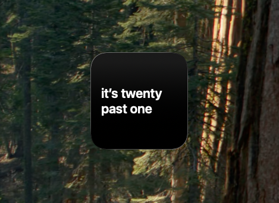

# Text Clock

A macOS desktop widget that tells the time in words, rounded to the nearest five minutes, in white on black.



- Dutch: “het is vijf voor half twaalf”
- English: “it’s quarter to ten”

The language follows your system language by default. Change it per widget with right-click → “Edit ‘Text Clock’”.

## Requirements

- macOS 14 (Sonoma) or later
- Xcode 15 or later
- [XcodeGen](https://github.com/yonaskolb/XcodeGen): `brew install xcodegen`

## Build and run

```sh
xcodegen generate
open TextClock.xcodeproj
```

Run the `TextClock` scheme once (⌘R). macOS only lists a widget after its host app has launched. Then right-click the desktop, choose “Edit Widgets…”, search for “Text Clock”, and drag it onto the desktop.

Signing uses the team set in `DEVELOPMENT_TEAM` in `project.yml`. WidgetKit won’t render an ad-hoc signed extension (it shows grey placeholder bars), so to build it yourself, change that team and the `nl.vincentbruijn` bundle identifiers to your own.

To install it permanently, archive or copy the built `TextClock.app` to `/Applications` and launch it once.

## Layout

| Path | What |
| --- | --- |
| `Packages/TextClockCore` | Phrasing and rounding logic, as a Swift package with tests |
| `Widget/` | WidgetKit extension (small, medium, large) |
| `App/` | Minimal host app with a live preview |
| `project.yml` | XcodeGen project spec |

## Tests

```sh
cd Packages/TextClockCore && swift test
```

## Adding a language

Add a case to `ClockLanguage` and a matching phrase function in `TextClock.swift`, then add the case to `LanguageOption` in the widget.

## Notes

When the desktop isn’t in focus, macOS may render widgets in its monochrome “vibrant” style, which drops the black background. On recent macOS versions you can keep it by setting System Settings → Desktop & Dock → Widgets → Widget style to “Full-color”.
